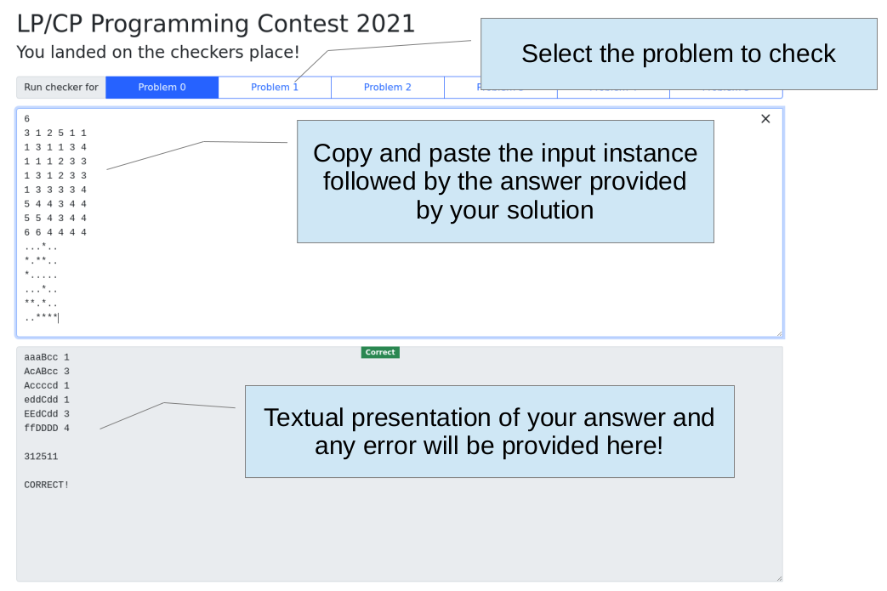

# LP/CP Programming Contest 2021

The traditional LP/CP Programming Contest will be run in virtual mode during ICLP 2021.
The contest will start on Friday 24 September at 12:00 (midday, UTC+1) and will last 24 hours.

The contest combines some features of Prolog programming contest, Answer Set Programming (ASP) Model and Solve contest, and Constraint Programming (CP) Model and Solve contest.
A variety of systems can be used in the competition, and as in the previous edition participants are not constrained to use a single system and can also combine declarative and imperative programming languages.
Submitted solutions are expected to have a declarative predominant core.

Input and output format of problems will be provided according to some easy-to-parse representation, and similarly output must be provided according to some easy-to-write format.
(Please, have a look at the [previous edition](https://github.com/alviano/lpcp-contest-2020) of the contest to get an idea of the input and output format.)

**Checkers will be provided to participants** in Python and also via a simple web page, so to ease the identification of bugs thanks to textual representations of testcases and solutions.

Each team consists of up to three participants.
Submitted solutions will be tested on additional instances, and are expected to terminate in 10 minutes on an Intel(R) Core(TM) i7-7600U CPU @ 2.80GHz.
Memory usage will be limited to 6 GiB.
Limits on the input (eg. range of variables) will be given for each problem.


## Checkers

For each problem we will provide in this git repository a checker written in Python and working in the terminal.
An example is given for the first problem of the previous edition, here referred to as [Problem 0](problem-0).
If `instance.0.in` and `instance.0.out` contain the input testcase and the provided answer, the checker can be run as follows:
```bash
$ cat instance.0.in instance.0.out | ./checker.py 
aaaBcc 1
AcABcc 3
Accccd 1
eddCdd 1
EEdCdd 3
ffDDDD 4
      
312511

CORRECT!
```

A browser version of all checkers will be given [here](https://lpcp-contest-2021.netlify.app/).
Please, refer to the following image for usage.




## Systems

The following systems can be used 

* SWI-Prolog: http://www.swi-prolog.org
* GNU Prolog: http://gprolog.org
* Ciao Prolog: http://ciao-lang.org
* ECLiPSe Prolog: http://eclipseclp.org
* XSB Prolog: http://xsb.sourceforge.net
* Potassco: http://potassco.sourceforge.net
* Picat: http://picat-lang.org
* MiniZinc: http://www.minizinc.org
* IDP: https://dtai.cs.kuleuven.be/software/idp

A Docker image where all systems are installed in is available from the previous edition of the contest. Details on the installation and usage of the Docker image can be found here.
It is suggested to try your systems of choice within the Docker image, and write us an email in case some wanted feature or system is missing.

Other systems can be used as well, among them

* z3: https://github.com/Z3Prover/z3

We may ask some help to run your solutions.


## Scoring

Participants will be ranked by **number of solved instances**.
A solution is valid as soon as it does not produce wrong answers for the tested instances (timeouts and memouts are OK, but will not contribute any point).
Participants will receive feedback on the number of solved instances and on errors of their submissions.
As a general suggestion, **submit solutions as soon as you have them**.


## Registration

Send an email to alviano@mat.unical.it with subject **LP/CP Programming Contest 2021 - Registration** and the following content:

* Team name;
* Comma-separated list of participants;
* Comma-separated list of affiliations;
* Comma-separated list of emails.

A confirmation email will be sent to you as soon as possible (usually within 24 hours).


## Submission

Via EasyChair at the following URL: https://easychair.org/conferences/?conf=iclp2021

For each problem you solved, submit a ZIP archive with all files needed to run your solution.
The title must obey the following format:

```
team-name:problem-number
```

A good entry-point is a script like `solve.sh` reading input instances from STDIN and producing output on STDOUT.
If you opt for a different entry-point or different usage, provide instructions on how to execute your solution in the abstract.

Keywords are not important, but you have to provide at least three of them. Use the following:

```
one
two
three
```


## Problems

* [Problem 1](problem-1)
* [Problem 2](problem-2)
* [Problem 3](problem-3)
* [Problem 4](problem-4)
* [Problem 5](problem-5)


## Participants

In alphabetical order:

* ASPirant: Jan Behrens. Potsdam University (Germany)
* EyFiBo: Selin Eyupoglu, Muge Fidan, Aysu Bogatarkan. Sabancı University (Turkey)
* One4All: Çağrı Uluç Yıldırımoğlu. Sabancı University (Turkey)
* Picat: Alfredo Beaumont, Peter Bernschneider, Neng-Fa Zhou. Basque Country, Germany, Brooklyn College (United States)
* Sebastiano: Sebastiaan J.C. Joosten. Dartmouth College (United States)
* Wolfs31: Giuseppe Mazzotta, Matteo Avolio. University of Calabria (Italy)


## Winner

TBA on Monday 27 at 17:30 CEST.
Stay tuned.
